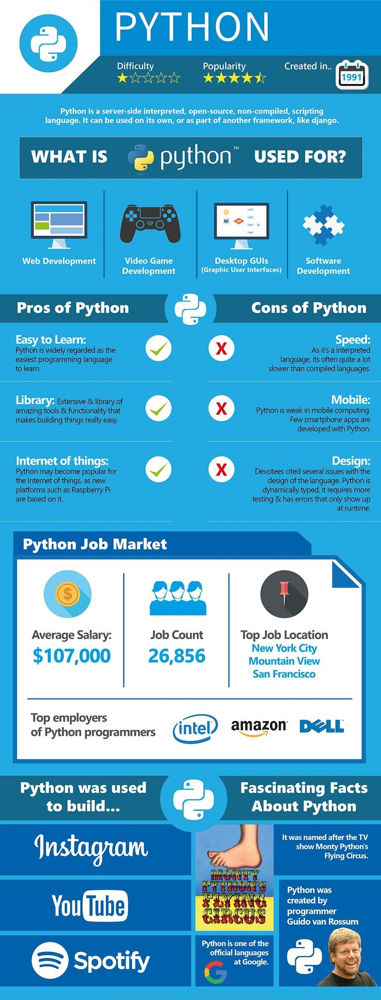

# zhengrr 所知的 Python

> 

人生苦短，我用 [*Python*](https://python.org "Python, 1991")。

*Guido van Rossum*

## 参考

[*Python 3 Docs*](https://docs.python.org/3/ "Python 3 documentation") (
  [*lang*](https://docs.python.org/3/reference "The Python Language Reference"),
  [*lib*](https://docs.python.org/3/library "The Python Standard Library") )

## 风格

/ [*PEP 8 -- Style Guide for Python Code*](https://python.org/dev/peps/pep-0008/)
/ [*PEP 224 -- Attribute Docstrings*](https://python.org/dev/peps/pep-0224/)
/ [*PEP 257 -- Docstring Conventions*](https://python.org/dev/peps/pep-0257/)
/ [*Sphinx*](https://www.sphinx-doc.org/) (
    [*Sphinx and RST syntax guide*](https://thomas-cokelaer.info/tutorials/sphinx/) )
/ [*reStructuredText*](http://docutils.sourceforge.net/rst.html)

## 指南

/ ["Python教程"](https://www.liaoxuefeng.com/wiki/0014316089557264a6b348958f449949df42a6d3a2e542c000). *廖雪峰的官方网站*.
/ ["机器学习速成课程"](https://developers.google.cn/machine-learning/crash-course/). *Google Developers*.

## Awesome

[*Awesome Python*](https://awesome-python.com/) (
  [*cmn-Hans*](http://python.jobbole.com/84464) )

/ [*Matplotlib*](https://matplotlib.org/) (
    [*cmn-Hans*](https://matplotlib.org.cn/) )
/ [*NumPy*](https://numpy.org/) (
    [*cmn-Hans*](https://numpy.org.cn/) )
/ [*pandas*](https://pandas.pydata.org/) (
    [*cmn-Hans*](https://pypandas.cn/) )
/ [*SciPy*](https://scipy.org/)
/ [*SymPy*](https://sympy.org/)

## 许可

项目采用 Unlicense 许可，文档采用 CC0-1.0 许可：

  
   
  To the extent possible under law,
  
    zhengrr
  has waived all copyright and related or neighboring rights to this work.

